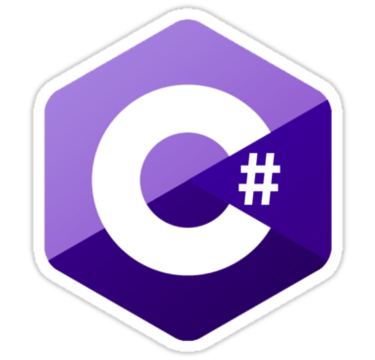

# Hi there 👋, My name is [Ahmed Hany](https://www.linkedin.com/in/ahmed-hany-33b3b420a/)

## I'm a Software Engineer interested in Full Stack Development, Machine Learning and Neural Networks 💻

<!-- image in markdown -->

##  About Me 

- 🤔&nbsp; Exploring new technologies and developing programming insights.
- 🚀 Former Backend Software Engineer <a href="https://www.linkedin.com/company/egabifsi/">@EgabiFSI</a>
- 🎓 Computer Engineering Student <a href="http://eng.cu.edu.eg/ar/">@Faculty of Engineering Cairo University</a>
- 🧠 &nbsp;I'am currently improving my FullStack Knowledge.
- 💻&nbsp;I'am currently learning Machine Learning and Artificial Intelligance.
- 🌟&nbsp;I'am passionate about FullStack Development, Embedded Systems, Artificial intelligance,Deep Learning and Competitive Programming.
- ❤️‍&nbsp;Ask me about anything i will be always happy to help.
- #### 📝 Checkout my <a href="https://drive.google.com/file/d/1a_4wMjnPkPBvvV1KSEN7t0wseK8Wt5Uy/view?usp=drive_link">Resume</a>

- #### 📫 How to reach me <a href="mailto:ahmed300hany@gmail.com">Mail</a>

 

  

## Technical Skills

<ul>
<li>

### Programming languages:

 

<code title="Python"></code>
<code title="Java"></code>
<code title="C"></code>
<code title="C++"></code>
<code title="C#"></code>
<code title="arduino"></code>
<code title="Assembly"></code>
<code title="Dart"></code>

</li>
<li>

### Frontend Development:

<code title="Html 5"></code>
<code title="CSS"></code>
<code title="JavaScript"></code>
<code title="Bootstrap"></code>
<code title="firebase"></code>
<code title="Flutter"></code>

 
</li>
<li>

### Backend && DataBase Development:

 

<code title="mongodb"></code>
<code title="Django"></code>
<code title="PHP"></code>
<code title="SQl"></code>
<code title="MySQL"></code>
<code title="Node.js"></code>
<code title="Spring Boot"></code>

 
</li>
<li>

### Software & Tools:

<code title="Git"></code>
<code title="GitHub"></code>
<code title="StackOverflow"></code>

 
</li>
<li>

### Operating Systems:

<code title="Linux"></code>
<code title="Windows"></code>
<code title="VMware"></code>

</ul>
 
</li>

## 📫 Connect with me: 

 

  
  
  
  
  

 

  

  <h3><b>📍Profile Visitor Count</b></h3>

    
<!-- retro visitor counter -->  

   
    

 

 

 

<table border="0" align="center">
<tr border="0">
<td width="50%" align="center">
  
  

  

  

 
 

  

